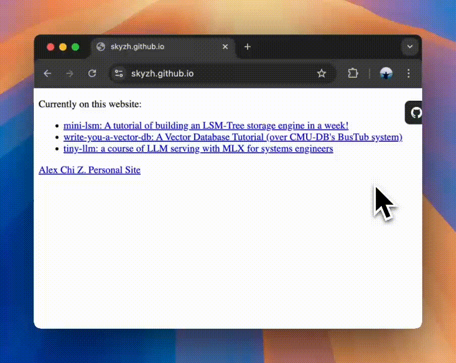

# Pages2GitHub

*Show me your code!* Access the GitHub profile from `*.github.io` sites.

## Installation

> [!note]
> Requires [Tampermonkey](https://www.tampermonkey.net/) browser extension (for desktop) or [Userscripts](https://itunes.apple.com/us/app/userscripts/id1463298887) App (for iOS/iPadOS).

[📦 Install on Greasyfork](https://greasyfork.org/en/scripts/534709-pages-to-github)

## License

[MIT](./LICENSE) License © 2025 [Super Lee](https://github.com/superpung)
